# Engenharia de Dados aplicada à análise do absenteísmo no trabalho

**Autor:** Mateus de Souza Gonçalves  
**Disciplina:** Engenharia de Dados — MVP  
**Plataforma:** Databricks Free Edition  
**Tecnologias:** Python, PySpark, SQL, Delta Lake e Unity Catalog

Este projeto implementa um pipeline de dados na nuvem para organizar e analisar a base **Absenteeism at work**. O processo contempla ingestão, padronização, verificações de qualidade, modelagem dimensional, documentação do catálogo e consultas analíticas. As camadas Bronze, Silver e Gold separam os dados ingeridos, os dados preparados e as tabelas voltadas ao consumo analítico.

A execução documentada preservou os **740 registros**, referentes a **36 empregados**, com **5.124 horas de ausência**. Este README reúne a documentação e as evidências da entrega, incluindo os 21 prints produzidos no Databricks.

## 1. Contexto de Negócios e Perguntas

O absenteísmo pode comprometer a produtividade e a organização do trabalho. Este MVP busca organizar e disponibilizar dados confiáveis para analisar como as horas de ausência estão distribuídas entre diferentes motivos, períodos e características dos empregados.

O objetivo de Engenharia de Dados é construir um fluxo reproduzível que transforme um arquivo CSV em tabelas persistidas, documentadas e adequadas às seguintes perguntas de negócio, mantidas conforme o notebook de análise:

1. Quais motivos concentram a maior quantidade de horas de ausência?
2. Como as horas de ausência variam entre os meses?
3. Como o absenteísmo varia entre as faixas etárias?
4. Como o absenteísmo varia conforme a distância entre residência e trabalho?

As respostas utilizam contagens de registros, totais de horas e médias de horas por registro. **As análises são descritivas e não demonstram causalidade.** A base não contém o total de horas de trabalho previstas para calcular uma taxa de absenteísmo. Por isso, uma média maior de horas por registro não deve ser interpretada como maior probabilidade de faltar ou como uma taxa maior de ausência entre todos os empregados.

## 2. Fonte dos Dados

Foi utilizada a base pública **Absenteeism at work**, disponibilizada pelo **UCI Machine Learning Repository**. Segundo a documentação da fonte, os registros foram coletados em uma empresa de entregas no Brasil, entre julho de 2007 e julho de 2010.

| Item | Descrição |
|---|---|
| Página da base | [Absenteeism at work — UCI](https://archive.ics.uci.edu/dataset/445/absenteeism+at+work) |
| Autoria da base | Andrea Martiniano e Ricardo Ferreira |
| Referência | Martiniano, A. & Ferreira, R. (2012). *Absenteeism at work* [Dataset]. UCI Machine Learning Repository |
| DOI | [10.24432/C5X882](https://doi.org/10.24432/C5X882) |
| Licença dos dados | [Creative Commons Attribution 4.0 International — CC BY 4.0](https://creativecommons.org/licenses/by/4.0/) |
| Arquivo utilizado | `Absenteeism_at_work.csv` |
| Formato | CSV com cabeçalho e separador `;` |
| Estrutura de origem | Uma tabela com 740 linhas e 21 colunas |

A licença CC BY 4.0 permite compartilhar e adaptar os dados, mediante atribuição de crédito, referência à licença e indicação das alterações realizadas. Neste projeto, as alterações consistem na padronização dos nomes das colunas, conversão de tipos, inclusão de metadados, criação de dimensões e agregações. Os registros de origem foram preservados.

As 21 colunas incluem um identificador de empregado, o motivo da ausência, atributos temporais, características do empregado e as horas de ausência. O arquivo não fornece uma chave única de ocorrência nem uma data completa com ano e dia do mês. O identificador do empregado pode aparecer em várias linhas.

O CSV original pode ser obtido pelo botão **Download** da página da UCI. Sua inclusão no repositório não é necessária para a entrega; a origem e o procedimento de obtenção estão documentados aqui.

## 3. Carga dos Dados

**Código:** [01_ingestao_bronze.py](notebooks/01_ingestao_bronze.py).

O arquivo CSV foi enviado para um volume do Unity Catalog no Databricks, mantendo o nome original. O caminho utilizado no processamento é:

```text
/Volumes/workspace/bronze/raw_files/Absenteeism_at_work.csv
```

A ingestão segue estas etapas:

1. Preparação dos schemas `bronze`, `silver` e `gold` e do volume `workspace.bronze.raw_files`.
2. Leitura do arquivo com cabeçalho, delimitador `;` e `inferSchema=False`, preservando inicialmente as 21 colunas de negócio como texto.
3. Conferência da quantidade de linhas, colunas e estrutura do DataFrame.
4. Renomeação explícita das 21 colunas para `snake_case`, respeitando a ordem do CSV e verificando a quantidade de nomes definida.
5. Inclusão de `source_file`, com o caminho do arquivo, e `ingestion_timestamp`, com a data e hora da ingestão.
6. Gravação em formato Delta, com `mode("overwrite")` e `overwriteSchema`, na tabela `workspace.bronze.absenteeism_raw`.
7. Leitura da tabela persistida para validar **740 linhas e 23 colunas**.

As duas colunas adicionais são metadados. A diferença entre as 21 colunas do CSV e as 23 da Bronze decorre exclusivamente dessa inclusão.

**Arquivo disponível no volume:**

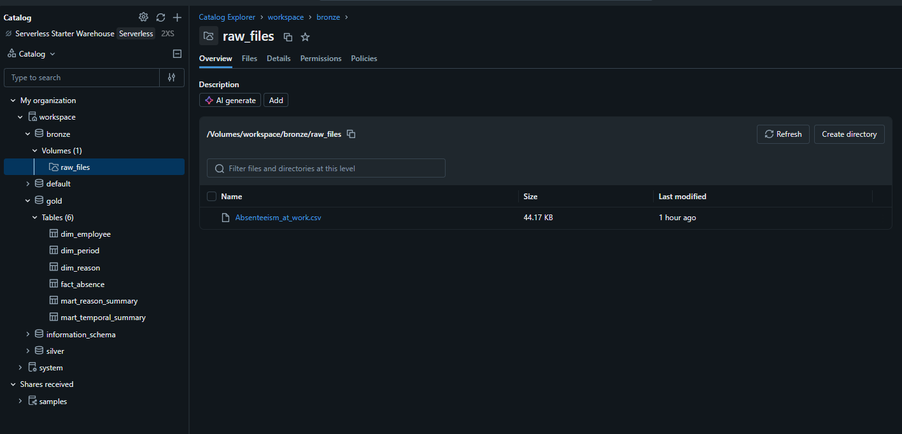

**Estrutura da camada Bronze:**

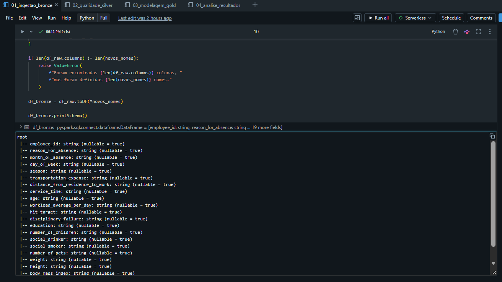

**Validação da tabela persistida:**

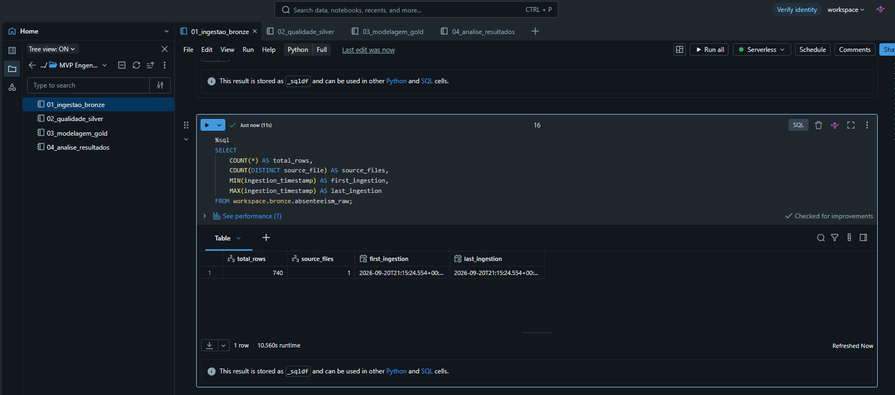

## 4. Modelagem e Catálogo

**Código:** [03_modelagem_gold.py](notebooks/03_modelagem_gold.py).

### 4.1 Organização das tabelas e linhagem

Foi adotado um modelo dimensional simplificado, em esquema estrela, com a tabela central `fact_absence` e as dimensões `dim_employee`, `dim_reason` e `dim_period`. Duas tabelas agregadas, denominadas *marts*, disponibilizam os indicadores por motivo e por mês e estação.

Todas as tabelas abaixo são persistidas em Delta e estão no catálogo `workspace`. As quantidades correspondem à execução documentada nas evidências.

| Schema e tabela | Finalidade e granularidade | Origem ou transformação | Linhas |
|---|---|---|---:|
| `bronze.absenteeism_raw` | Uma linha por registro ingerido | CSV, renomeação e metadados | 740 |
| `silver.absenteeism_clean` | Uma linha por registro preparado | Bronze, remoção de espaços e conversão de tipos | 740 |
| `silver.dq_completeness_bronze` | Uma linha por coluna de negócio avaliada | Contagem de nulos e vazios na Bronze | 21 |
| `silver.dq_duplicates_bronze` | Resumo da investigação de repetições | Agrupamento pelas 21 colunas de negócio | 1 |
| `silver.dq_domain_rules_bronze` | Uma linha por regra de domínio | Validação sobre o DataFrame tipado | 13 |
| `silver.dq_outliers_bronze` | Uma linha por variável numérica avaliada | Quartis e limites IQR sobre o DataFrame tipado | 12 |
| `gold.dim_employee` | Um perfil representativo por empregado | Perfil completo mais frequente na Silver | 36 |
| `gold.dim_reason` | Um registro por código de motivo | Mapeamento explícito dos códigos de 0 a 28 | 29 |
| `gold.dim_period` | Uma combinação de mês, dia da semana e estação | Combinações distintas existentes na Silver | 82 |
| `gold.fact_absence` | Uma linha por registro da Silver | Chave técnica, chaves de dimensão, medidas e metadados | 740 |
| `gold.mart_reason_summary` | Um registro por motivo observado | Fato e dimensão de motivos, com agregação | 28 |
| `gold.mart_temporal_summary` | Um registro por combinação de mês e estação observada | Fato e dimensão de período, com agregação | 19 |

As tabelas de qualidade usam o sufixo `_bronze` por documentarem a avaliação dos dados ingeridos. As regras de domínio e os outliers são calculados após a conversão dos tipos, antes da persistência da Silver.

### 4.2 Relacionamentos e decisões de modelagem

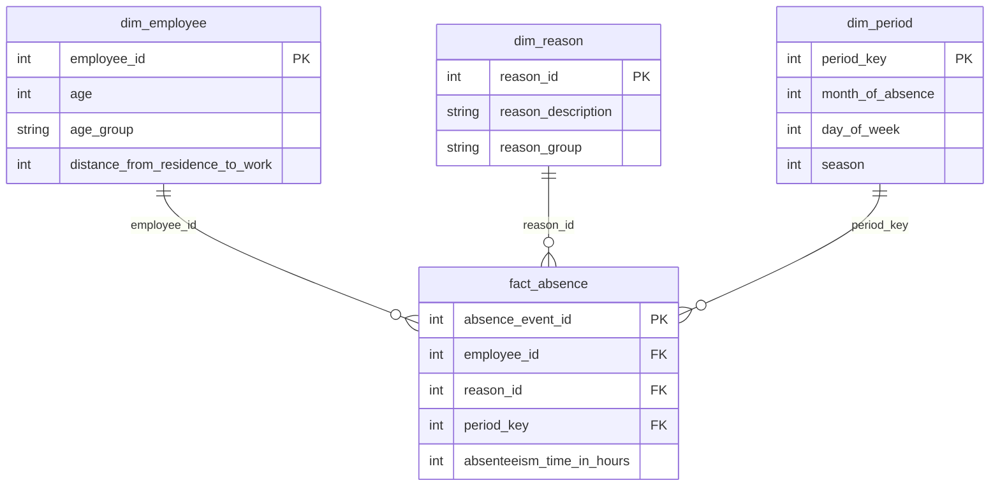

O diagrama mostra os campos centrais; o catálogo abaixo documenta os demais. As chaves representam os relacionamentos lógicos do modelo. Os scripts não declaram restrições físicas de chave primária ou estrangeira.

- **Grão da fato:** cada linha da Silver gera uma linha em `fact_absence`, inclusive os registros com valores repetidos e com zero horas.
- **Identificador técnico:** `absence_event_id` é produzido por `ROW_NUMBER()`. Identifica a linha dentro da carga, mas não constitui uma chave de ocorrência fornecida pela fonte nem um identificador garantidamente estável entre reprocessamentos.
- **Perfil do empregado:** a dimensão seleciona a combinação completa de atributos mais frequente por `employee_id`. Isso evita multiplicar os registros da fato ao fazer a junção. O perfil representa a base como um todo; não corresponde necessariamente ao perfil na data de cada ocorrência. A versão atual não define um critério adicional para desempatar perfis de igual frequência.
- **Dimensão de período:** `period_key = month_of_absence * 100 + day_of_week * 10 + season`. Ela representa uma combinação de atributos temporais, e não uma data de calendário.
- **Motivos:** a dimensão contém os 29 códigos previstos no projeto. A mart contém 28 códigos observados na fato; a diferença de contagem não indica perda de registros.
- **Agregações:** `mart_reason_summary` agrupa por motivo; `mart_temporal_summary` agrupa por mês e estação. A análise mensal reúne as combinações de estação de cada mês e calcula a média pela divisão do total de horas pelo total de registros.

### 4.3 Dicionário das colunas da Bronze e da Silver

As tabelas `workspace.bronze.absenteeism_raw` e `workspace.silver.absenteeism_clean` compartilham os mesmos 23 nomes de coluna. Na Bronze, as 21 colunas de negócio são `STRING`; na Silver, são aplicados os tipos indicados abaixo. Os metadados mantêm `STRING` e `TIMESTAMP`, respectivamente.

Os domínios descrevem o significado esperado dos campos. **Eles não devem ser confundidos com a lista de regras implementadas**, apresentada na seção de qualidade. Quando não existe teto documentado, não foi inventado um limite máximo. A referência para os significados originais é a documentação da UCI; as escolhas de padronização e tratamento estão nos notebooks.

| Campo original → campo padronizado | Tipo na Silver | Significado e domínio | Transformação ou origem |
|---|---|---|---|
| `ID` → `employee_id` | `INT` | Identificador do empregado; 1 a 36 nesta base | Renomeação e conversão para inteiro |
| `Reason for absence` → `reason_for_absence` | `INT` | Código entre 0 e 28; 0 é tratado como não informado | Renomeação e conversão; descrição na dimensão de motivos |
| `Month of absence` → `month_of_absence` | `INT` | 1 a 12; 0 é tratado como mês não informado | Renomeação e conversão |
| `Day of the week` → `day_of_week` | `INT` | 2: segunda; 3: terça; 4: quarta; 5: quinta; 6: sexta | Renomeação e conversão |
| `Seasons` → `season` | `INT` | 1: verão; 2: outono; 3: inverno; 4: primavera | Renomeação e conversão |
| `Transportation expense` → `transportation_expense` | `INT` | Despesa de transporte; valor não negativo, sem teto definido no projeto | Renomeação e conversão; não foi atribuída uma moeda não documentada |
| `Distance from Residence to Work` → `distance_from_residence_to_work` | `INT` | Distância em quilômetros; valor não negativo, sem teto definido | Renomeação e conversão |
| `Service time` → `service_time` | `INT` | Tempo de serviço na escala original; valor não negativo, sem teto definido | Renomeação e conversão, sem alteração de unidade |
| `Age` → `age` | `INT` | Idade em anos; maior que zero, sem teto definido | Renomeação e conversão |
| `Work load Average/day` → `workload_average_per_day` | `DOUBLE` | Carga média diária de trabalho na escala original; valor não negativo, sem teto definido | Remoção de espaços, troca de vírgula por ponto e conversão |
| `Hit target` → `hit_target` | `INT` | Indicador de atingimento da meta na escala original; sem intervalo imposto pelo pipeline | Renomeação e conversão; avaliação de valores extremos |
| `Disciplinary failure` → `disciplinary_failure` | `INT` | Indicador disciplinar: 0 = não; 1 = sim | Renomeação e conversão |
| `Education` → `education` | `INT` | 1 = ensino médio; 2 = graduação; 3 = pós-graduação; 4 = mestrado ou doutorado | Renomeação e conversão |
| `Son` → `number_of_children` | `INT` | Quantidade de filhos; inteiro não negativo, sem teto definido | Renomeação e conversão |
| `Social drinker` → `social_drinker` | `INT` | Consumo social de bebida: 0 = não; 1 = sim | Renomeação e conversão |
| `Social smoker` → `social_smoker` | `INT` | Tabagismo social: 0 = não; 1 = sim | Renomeação e conversão |
| `Pet` → `number_of_pets` | `INT` | Quantidade de animais de estimação; inteiro não negativo, sem teto definido | Renomeação e conversão |
| `Weight` → `weight` | `INT` | Peso informado na escala original; maior que zero, sem teto definido | Renomeação e conversão |
| `Height` → `height` | `INT` | Altura informada na escala original; maior que zero, sem teto definido | Renomeação e conversão |
| `Body mass index` → `body_mass_index` | `INT` | Índice de massa corporal; maior que zero, sem teto definido | Renomeação e conversão, sem recálculo |
| `Absenteeism time in hours` → `absenteeism_time_in_hours` | `INT` | Horas de ausência por registro; inteiro não negativo, sem teto de domínio definido | Renomeação e conversão |
| Metadado → `source_file` | `STRING` | Caminho não vazio do arquivo ingerido | Literal com o caminho do CSV no volume |
| Metadado → `ingestion_timestamp` | `TIMESTAMP` | Data e hora de processamento, não da ausência | `current_timestamp()` na ingestão |

**Estrutura tipada na Silver:**

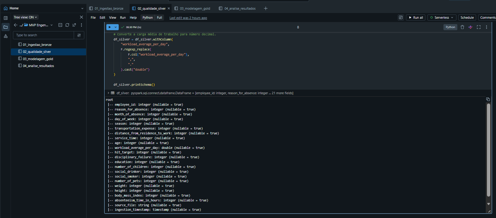

### 4.4 Catálogo das dimensões Gold

**Tabela `workspace.gold.dim_employee` — 16 colunas.** Um registro por empregado, originado do perfil mais frequente na Silver.

| Campo | Tipo | Descrição, domínio e linhagem |
|---|---|---|
| `employee_id` | `INT` | Chave lógica do empregado; domínio da Silver |
| `transportation_expense` | `INT` | Despesa de transporte do perfil selecionado; domínio da Silver |
| `distance_from_residence_to_work` | `INT` | Distância do perfil selecionado, em km; domínio da Silver |
| `service_time` | `INT` | Tempo de serviço do perfil selecionado; domínio da Silver |
| `age` | `INT` | Idade do perfil selecionado; domínio da Silver |
| `age_group` | `STRING` | Derivada de `age`: Até 29 anos; 30 a 39 anos; 40 a 49 anos; 50 anos ou mais |
| `education` | `INT` | Código educacional do perfil selecionado; 1 a 4 |
| `education_level` | `STRING` | Tradução de `education`: Ensino médio; Graduação; Pós-graduação; Mestrado ou doutorado |
| `number_of_children` | `INT` | Número de filhos do perfil selecionado; domínio da Silver |
| `social_drinker` | `INT` | Indicador do perfil selecionado; 0 ou 1 |
| `social_smoker` | `INT` | Indicador do perfil selecionado; 0 ou 1 |
| `number_of_pets` | `INT` | Número de animais do perfil selecionado; domínio da Silver |
| `weight` | `INT` | Peso do perfil selecionado; domínio da Silver |
| `height` | `INT` | Altura do perfil selecionado; domínio da Silver |
| `body_mass_index` | `INT` | IMC do perfil selecionado; domínio da Silver |
| `observed_profile_frequency` | `BIGINT` | `COUNT(*)` das linhas com o perfil completo selecionado; entre 1 e o total de registros do empregado |

**Tabela `workspace.gold.dim_reason` — 3 colunas.** Mapeamento explícito dos motivos, construído no notebook 3.

| Campo | Tipo | Descrição, domínio e linhagem |
|---|---|---|
| `reason_id` | `INT` | Chave lógica do motivo; códigos de 0 a 28 |
| `reason_description` | `STRING` | Descrição em português associada ao código, conforme o mapeamento abaixo |
| `reason_group` | `STRING` | `Sem classificação` para 0; `CID` para 1 a 21; `Sem CID` para 22 a 28 |

| Código | Descrição adotada no projeto |
|---:|---|
| 0 | Não informado |
| 1 | Doenças infecciosas e parasitárias |
| 2 | Neoplasias |
| 3 | Doenças do sangue e transtornos imunitários |
| 4 | Doenças endócrinas nutricionais e metabólicas |
| 5 | Transtornos mentais e comportamentais |
| 6 | Doenças do sistema nervoso |
| 7 | Doenças dos olhos e anexos |
| 8 | Doenças do ouvido |
| 9 | Doenças do aparelho circulatório |
| 10 | Doenças do aparelho respiratório |
| 11 | Doenças do aparelho digestivo |
| 12 | Doenças da pele e tecido subcutâneo |
| 13 | Doenças osteomusculares e do tecido conjuntivo |
| 14 | Doenças do aparelho geniturinário |
| 15 | Gravidez parto e puerpério |
| 16 | Afecções originadas no período perinatal |
| 17 | Malformações congênitas |
| 18 | Sintomas e achados não classificados |
| 19 | Lesões, intoxicações e outras consequências de causas externas |
| 20 | Causas externas de morbidade e mortalidade |
| 21 | Fatores que influenciam o estado de saúde |
| 22 | Acompanhamento de paciente |
| 23 | Consulta médica |
| 24 | Doação de sangue |
| 25 | Exame laboratorial |
| 26 | Ausência injustificada |
| 27 | Fisioterapia |
| 28 | Consulta odontológica |

**Tabela `workspace.gold.dim_period` — 7 colunas.** Combinações distintas dos atributos temporais da Silver.

| Campo | Tipo | Descrição, domínio e linhagem |
|---|---|---|
| `period_key` | `INT` | Chave derivada de mês × 100 + dia × 10 + estação; entre 21 e 1.264 dentro dos domínios aceitos, apenas combinações observadas |
| `month_of_absence` | `INT` | Mês original; 0 a 12 |
| `month_name` | `STRING` | Janeiro a Dezembro ou Não informado; tradução de `month_of_absence` |
| `day_of_week` | `INT` | Dia da semana original; 2 a 6 |
| `day_name` | `STRING` | Segunda-feira a Sexta-feira; tradução de `day_of_week` |
| `season` | `INT` | Estação original; 1 a 4 |
| `season_name` | `STRING` | Verão, Outono, Inverno ou Primavera; tradução de `season` |

### 4.5 Catálogo da fato e das marts Gold

**Tabela `workspace.gold.fact_absence` — 10 colunas.** Cada registro da Silver é preservado uma vez.

| Campo | Tipo | Descrição, domínio e linhagem |
|---|---|---|
| `absence_event_id` | `INT` | Identificador técnico gerado por `ROW_NUMBER()`; 1 a 740 na carga documentada |
| `employee_id` | `INT` | Identificador preservado da Silver; relacionamento com `dim_employee` |
| `reason_id` | `INT` | Renomeação de `reason_for_absence`; 0 a 28; relacionamento com `dim_reason` |
| `period_key` | `INT` | Mesma fórmula da dimensão temporal; relacionamento com `dim_period` |
| `workload_average_per_day` | `DOUBLE` | Carga média de trabalho preservada da Silver; domínio do dicionário comum |
| `hit_target` | `INT` | Atingimento da meta preservado da Silver; domínio do dicionário comum |
| `disciplinary_failure` | `INT` | Indicador disciplinar preservado; 0 ou 1 |
| `absenteeism_time_in_hours` | `INT` | Horas de ausência preservadas; valor não negativo |
| `source_file` | `STRING` | Caminho de origem preservado da Bronze e da Silver |
| `ingestion_timestamp` | `TIMESTAMP` | Momento da ingestão preservado da Bronze e da Silver |

**Tabela `workspace.gold.mart_reason_summary` — 6 colunas.** Agregação da fato após `LEFT JOIN` com `dim_reason` por `reason_id`.

| Campo | Tipo | Descrição, domínio e linhagem |
|---|---|---|
| `reason_id` | `INT` | Código observado na fato; 0 a 28 |
| `reason_description` | `STRING` | Descrição obtida em `dim_reason` |
| `reason_group` | `STRING` | Grupo obtido em `dim_reason`: CID, Sem CID ou Sem classificação |
| `event_count` | `BIGINT` | `COUNT(*)` por motivo; entre 1 e o total de linhas da fato |
| `total_absence_hours` | `BIGINT` | `SUM(absenteeism_time_in_hours)` por motivo; entre 0 e o total de horas da fato |
| `average_absence_hours` | `DOUBLE` | `ROUND(AVG(absenteeism_time_in_hours), 2)`; média não negativa por registro |

**Tabela `workspace.gold.mart_temporal_summary` — 7 colunas.** Agregação da fato após `LEFT JOIN` com `dim_period` por `period_key`, agrupada por mês e estação.

| Campo | Tipo | Descrição, domínio e linhagem |
|---|---|---|
| `month_of_absence` | `INT` | Mês obtido em `dim_period`; 0 a 12 |
| `month_name` | `STRING` | Nome obtido em `dim_period`, incluindo Não informado |
| `season` | `INT` | Código obtido em `dim_period`; 1 a 4 |
| `season_name` | `STRING` | Nome obtido em `dim_period`; quatro estações |
| `event_count` | `BIGINT` | `COUNT(*)` por mês e estação; entre 1 e o total de linhas da fato |
| `total_absence_hours` | `BIGINT` | Soma de horas por mês e estação; entre 0 e o total de horas da fato |
| `average_absence_hours` | `DOUBLE` | Média de horas por registro, arredondada para duas casas; valor não negativo |

### 4.6 Catálogo das tabelas de qualidade

As quatro tabelas são produzidas em [02_qualidade_silver.py](notebooks/02_qualidade_silver.py). As contagens são números inteiros `BIGINT`; quartis, limites e percentuais são `DOUBLE`.

| Tabela | Campo | Tipo | Descrição, domínio e origem |
|---|---|---|---|
| `dq_completeness_bronze` | `column_name` | `STRING` | Nome de uma das 21 colunas de negócio da Bronze |
| `dq_completeness_bronze` | `missing_count` | `BIGINT` | Quantidade de nulos ou textos vazios após `trim`; 0 a 740 |
| `dq_completeness_bronze` | `complete_count` | `BIGINT` | Total de linhas menos `missing_count`; 0 a 740 |
| `dq_completeness_bronze` | `missing_percentage` | `DOUBLE` | `missing_count / total_rows × 100`, com duas casas; 0 a 100 |
| `dq_duplicates_bronze` | `total_rows` | `BIGINT` | Total de linhas avaliadas; 740 na carga |
| `dq_duplicates_bronze` | `duplicate_groups` | `BIGINT` | Grupos com mais de uma linha igual nas colunas de negócio; contagem não negativa |
| `dq_duplicates_bronze` | `duplicate_extra_rows` | `BIGINT` | Soma de `count - 1` nos grupos repetidos; 0 a `total_rows - 1` |
| `dq_duplicates_bronze` | `treatment` | `STRING` | Decisão documentada de preservar os registros por ausência de chave única da ocorrência |
| `dq_domain_rules_bronze` | `quality_rule` | `STRING` | Nome de uma das 13 regras implementadas |
| `dq_domain_rules_bronze` | `invalid_count` | `BIGINT` | Quantidade de violações da regra; 0 a 740 |
| `dq_domain_rules_bronze` | `status` | `STRING` | `OK` se não houver violações; `REVIEW` se houver |
| `dq_outliers_bronze` | `column_name` | `STRING` | Nome de uma das 12 variáveis numéricas avaliadas |
| `dq_outliers_bronze` | `q1` | `DOUBLE` | Primeiro quartil calculado com `approxQuantile`; mesma escala da variável |
| `dq_outliers_bronze` | `q3` | `DOUBLE` | Terceiro quartil; maior ou igual a `q1` |
| `dq_outliers_bronze` | `lower_limit` | `DOUBLE` | `q1 - 1,5 × (q3 - q1)`; pode ser negativo mesmo em variável não negativa |
| `dq_outliers_bronze` | `upper_limit` | `DOUBLE` | `q3 + 1,5 × (q3 - q1)`; maior ou igual ao limite inferior |
| `dq_outliers_bronze` | `possible_outlier_count` | `BIGINT` | Registros abaixo do limite inferior ou acima do superior; 0 a 740 |

A verificação de conversão usa adicionalmente o DataFrame `df_conversion_check`, com `column_name` (`STRING`) e `nulls_after_conversion` (`BIGINT`, de 0 a 740). Esse resultado é exibido no notebook, mas não é persistido como uma quinta tabela de qualidade.

### 4.7 Documentação no Unity Catalog

O notebook 3 aplica comentários às 12 tabelas e às respectivas colunas por meio de `COMMENT ON TABLE` e `ALTER TABLE ... ALTER COLUMN ... COMMENT`. O catálogo transcrito neste README complementa esses comentários com domínios, granularidade e linhagem.

**Organização das seis tabelas Gold:**

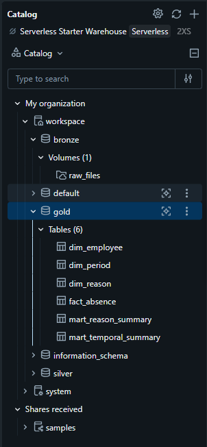

**Tipos e comentários das colunas da fato:**

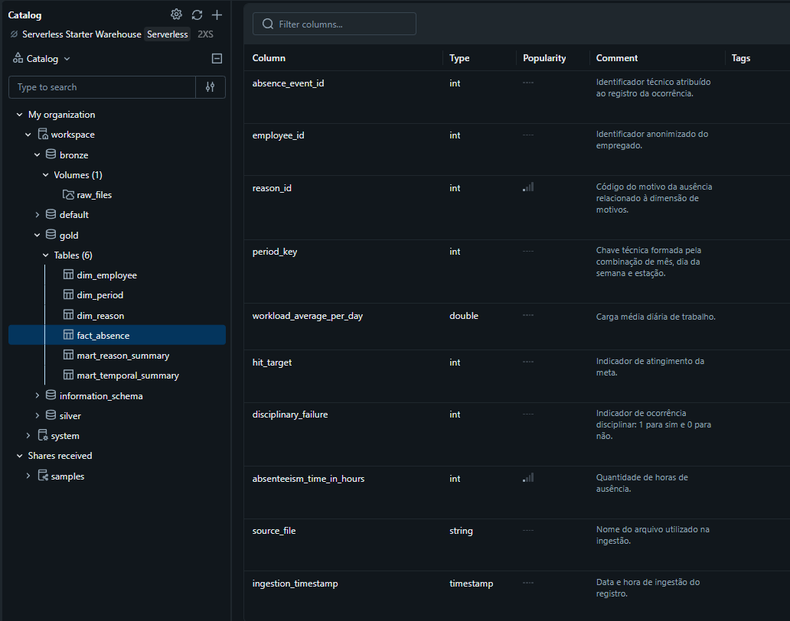

## 5. Pipeline de Dados

O processamento foi dividido em quatro notebooks, executados sequencialmente no Databricks. A carga é completa e em lote, adequada ao arquivo estático utilizado no MVP.

| Ordem | Notebook | Entradas | Processamento e saídas |
|---:|---|---|---|
| 1 | [01_ingestao_bronze.py](notebooks/01_ingestao_bronze.py) | CSV no volume | Leitura, nomes `snake_case`, metadados e persistência da Bronze |
| 2 | [02_qualidade_silver.py](notebooks/02_qualidade_silver.py) | Bronze | Completude, repetições, tipagem, domínios, outliers, quatro relatórios de qualidade e Silver |
| 3 | [03_modelagem_gold.py](notebooks/03_modelagem_gold.py) | Silver | Dimensões, fato, marts, validações de contagem e comentários no catálogo |
| 4 | [04_analise_resultados.py](notebooks/04_analise_resultados.py) | Gold | Indicadores, respostas às quatro perguntas, interpretações e conclusões |

As gravações em PySpark utilizam `overwrite`. As tabelas Gold são criadas com `CREATE OR REPLACE TABLE ... USING DELTA`. Assim, o reprocessamento substitui o conteúdo das tabelas do projeto, sem acrescentar uma segunda cópia das mesmas linhas. Os metadados de ingestão são atualizados quando a Bronze é reconstruída.

Na passagem da Bronze para a Silver, foram removidos espaços nas extremidades dos valores e convertidos os tipos. Não houve exclusão automática de repetições, de possíveis outliers ou de códigos zero. Na Gold, as junções com as dimensões acrescentam contexto e permitem agregações.

A comparação entre Silver e fato apresentou **740 linhas em ambas**. As contagens das seis tabelas Gold estão registradas abaixo. O notebook 3 também consulta os totais de eventos e as descrições ausentes nas duas marts.

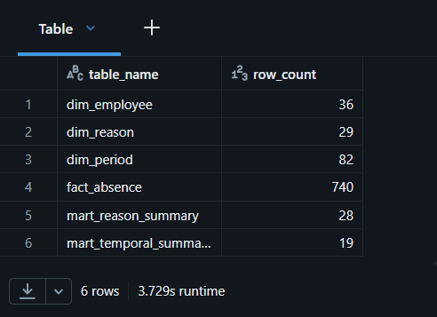

A execução foi organizada manualmente pela ordem dos notebooks. Agendamento automático, carga incremental e tratamento de histórico não fazem parte desta versão do MVP.

## 6. Qualidade dos Dados

**Código:** [02_qualidade_silver.py](notebooks/02_qualidade_silver.py).

### 6.1 Completude e conversão dos tipos

A completude foi avaliada nas 21 colunas de negócio, considerando ausentes os valores nulos ou vazios após a remoção de espaços. O relatório documentado apresenta **zero valores ausentes**, com 740 valores preenchidos por coluna.

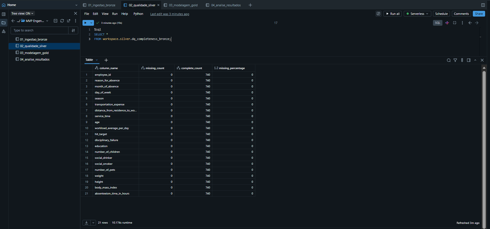

Foram convertidas 20 colunas para `INT` e `workload_average_per_day` para `DOUBLE`. O notebook inclui uma verificação de nulos após a conversão. Os campos `source_file` e `ingestion_timestamp` são preservados como metadados.

Preenchimento não significa informação completa sobre o fenômeno: os códigos zero de motivo e mês são valores presentes, mas são tratados no projeto como não informados ou não classificados. Não foi realizada imputação.

### 6.2 Registros com valores repetidos

Foram identificados **26 grupos de registros com valores repetidos, correspondentes a 34 linhas adicionais**. Os registros foram preservados porque a base não possui uma chave única de ocorrência que permita classificá-los com segurança como duplicidades indevidas.

A comparação considera todas as 21 colunas de negócio e exclui os metadados de ingestão. As 34 linhas são as repetições além da primeira linha de cada grupo. Elas não representam 34 grupos nem comprovam 34 erros de cadastro. Excluir essas linhas poderia eliminar ocorrências legítimas e alterar as medidas de absenteísmo.

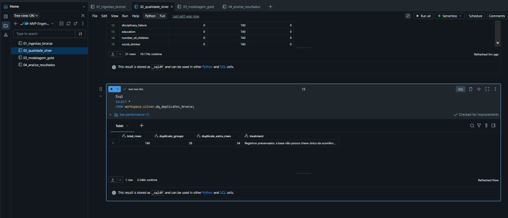

### 6.3 Consistência e regras de domínio

As regras implementadas avaliaram os seguintes domínios:

| Campo | Regra aplicada |
|---|---|
| `reason_for_absence` | Entre 0 e 28 |
| `month_of_absence` | Entre 0 e 12 |
| `day_of_week` | Entre 2 e 6 |
| `season` | Entre 1 e 4 |
| `education` | Entre 1 e 4 |
| `disciplinary_failure` | 0 ou 1 |
| `social_drinker` | 0 ou 1 |
| `social_smoker` | 0 ou 1 |
| `age` | Maior que zero |
| `weight` | Maior que zero |
| `height` | Maior que zero |
| `body_mass_index` | Maior que zero |
| `absenteeism_time_in_hours` | Maior ou igual a zero |

O relatório apresenta **zero violações nas 13 regras**, com status `OK`. Os códigos zero de motivo e mês foram admitidos deliberadamente. As consultas analíticas excluem esses códigos apenas dos recortes específicos que exigem uma categoria informada.

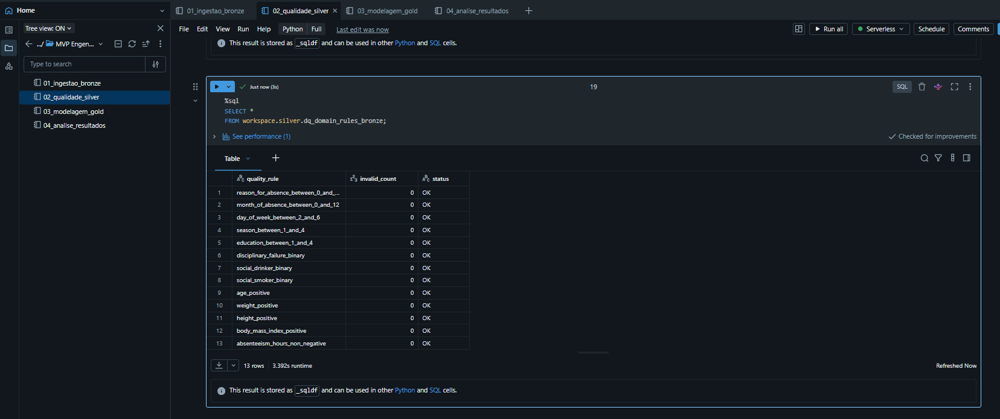

Essas verificações avaliam consistência e plausibilidade. A acurácia dos registros em relação aos acontecimentos reais não pode ser confirmada sem acesso aos registros operacionais da organização de origem.

### 6.4 Possíveis outliers

Foram avaliadas 12 variáveis numéricas pela regra do intervalo interquartil:

```text
IQR = Q3 - Q1
Limite inferior = Q1 - 1,5 × IQR
Limite superior = Q3 + 1,5 × IQR
```

O código utiliza `approxQuantile(..., [0.25, 0.75], 0.01)`. Portanto, os quartis são aproximados, com o parâmetro de erro relativo definido no notebook. As contagens abaixo reproduzem a execução registrada no print; não foram substituídas por resultados de outro método de quantis.

| Variável | Possíveis outliers |
|---|---:|
| `height` | 119 |
| `number_of_pets` | 46 |
| `absenteeism_time_in_hours` | 44 |
| `workload_average_per_day` | 32 |
| `hit_target` | 19 |
| `age` | 8 |
| `service_time` | 5 |
| `transportation_expense` | 3 |
| `distance_from_residence_to_work` | 0 |
| `number_of_children` | 0 |
| `weight` | 0 |
| `body_mass_index` | 0 |

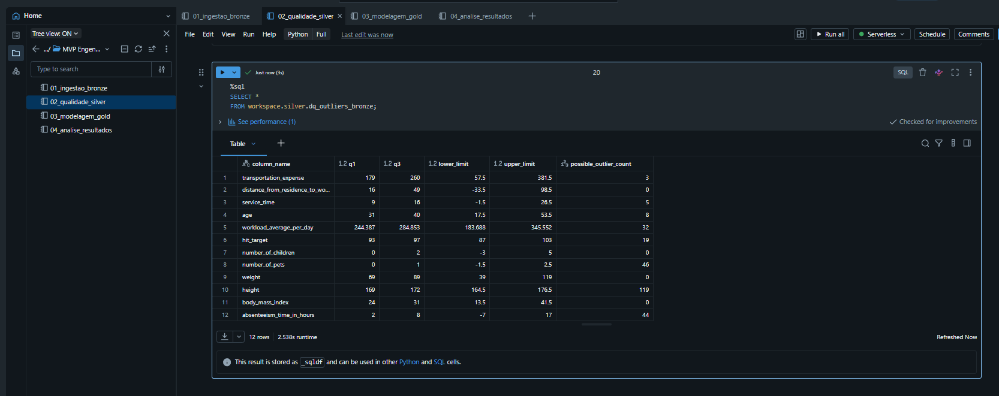

Esses valores são **sinalizações estatísticas, não erros comprovados**. Os registros foram mantidos. Um mesmo registro pode ser sinalizado em mais de uma variável; somar as contagens não informa a quantidade de linhas distintas com outliers. No caso de altura, a repetição de características de um mesmo empregado entre ocorrências também deve ser considerada ao interpretar as 119 linhas sinalizadas.

### 6.5 Resultado do tratamento

A preparação produziu nomes padronizados, tipos adequados ao cálculo e relatórios de qualidade persistidos. As **740 linhas foram preservadas** da Bronze até a fato. O tratamento torna explícitas as limitações e decisões, sem remover registros apenas por serem repetidos ou estatisticamente extremos.

## 7. Análise dos Resultados

**Código:** [04_analise_resultados.py](notebooks/04_analise_resultados.py).

Os números a seguir são os resultados da execução registrada nas evidências. As médias representam horas por registro de ausência. As faixas de idade e distância são calculadas com o perfil representativo de `dim_employee`.

### 7.1 Indicadores gerais

| Indicador | Resultado |
|---|---:|
| Registros na fato | 740 |
| Empregados distintos | 36 |
| Total de horas de ausência | 5.124 |
| Média de horas por registro | 6,92 |
| Mediana de horas por registro | 3 |

A média resulta da divisão das 5.124 horas pelos 740 registros. A mediana é obtida no notebook com `PERCENTILE_APPROX(..., 0.5)`. A diferença entre média e mediana é compatível com a influência de registros de maior duração sobre a média.

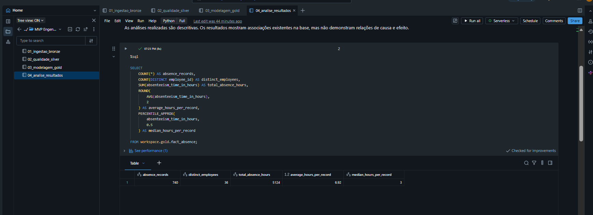

### 7.2 Quais motivos concentram a maior quantidade de horas de ausência?

A consulta ordena os motivos pelo total de horas, exclui o código zero e apresenta os dez maiores resultados.

| Código | Motivo | Registros | Horas | Média por registro |
|---:|---|---:|---:|---:|
| 13 | Doenças osteomusculares e do tecido conjuntivo | 55 | 842 | 15,31 |
| 19 | Lesões, intoxicações e outras consequências de causas externas | 40 | 729 | 18,23 |
| 23 | Consulta médica | 149 | 424 | 2,85 |
| 28 | Consulta odontológica | 112 | 335 | 2,99 |
| 11 | Doenças do aparelho digestivo | 26 | 297 | 11,42 |
| 22 | Acompanhamento de paciente | 38 | 293 | 7,71 |
| 10 | Doenças do aparelho respiratório | 25 | 276 | 11,04 |
| 26 | Ausência injustificada | 33 | 240 | 7,27 |
| 18 | Sintomas e achados não classificados | 21 | 217 | 10,33 |
| 12 | Doenças da pele e tecido subcutâneo | 8 | 187 | 23,38 |

As doenças osteomusculares e do tecido conjuntivo concentram o maior total, com **842 horas**. As lesões, intoxicações e outras consequências de causas externas aparecem em segundo lugar, com **729 horas**; consultas médicas somam **424 horas**. As diferenças são de 113 horas entre os dois primeiros grupos e de 305 horas entre o segundo e o terceiro.

Frequência e duração descrevem aspectos diferentes: consultas médicas têm mais registros que os dois primeiros grupos, mas apresentam menor média de horas por registro. Os dados podem orientar investigações agregadas e o planejamento de ações de saúde ocupacional, sem atribuir causalidade às características dos empregados.

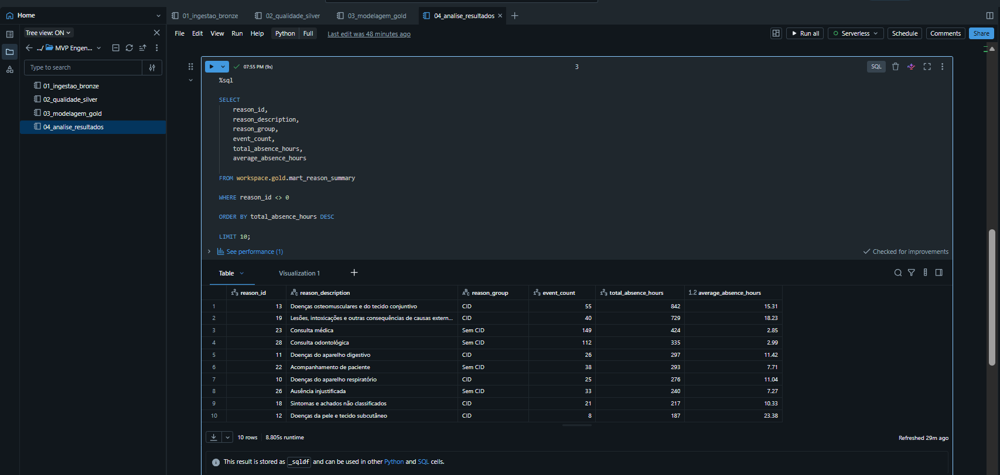

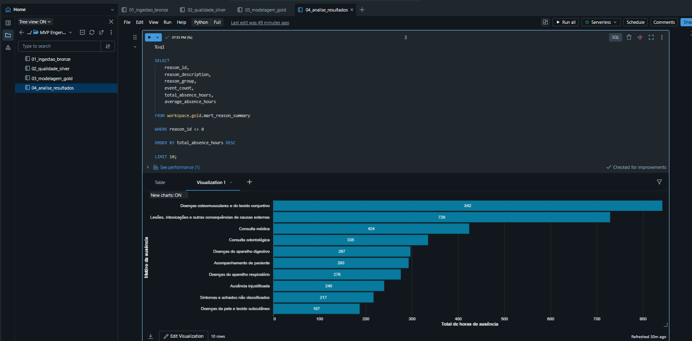

### 7.3 Como as horas de ausência variam entre os meses?

| Mês | Registros | Horas | Média por registro |
|---|---:|---:|---:|
| Janeiro | 50 | 222 | 4,44 |
| Fevereiro | 72 | 294 | 4,08 |
| Março | 87 | 765 | 8,79 |
| Abril | 53 | 482 | 9,09 |
| Maio | 64 | 400 | 6,25 |
| Junho | 54 | 411 | 7,61 |
| Julho | 67 | 734 | 10,96 |
| Agosto | 54 | 288 | 5,33 |
| Setembro | 53 | 292 | 5,51 |
| Outubro | 71 | 349 | 4,92 |
| Novembro | 63 | 473 | 7,51 |
| Dezembro | 49 | 414 | 8,45 |

**Março apresentou o maior total, com 765 horas**, e janeiro o menor, com 222 horas. A maior média por registro ocorreu em julho, com 10,96 horas. Isso diferencia o mês de maior volume acumulado do mês de maior duração média por registro.

A consulta exclui `month_of_absence = 0`. Os meses informados somam 737 registros e as mesmas 5.124 horas do total geral. Pela diferença entre os totais, os três registros com mês não informado não acrescentam horas à soma, mas permanecem na fato e nos indicadores gerais.

O resultado reúne registros de mesmo mês ao longo de todo o período da fonte. Como não há uma coluna de ano ou data completa, a tabela não permite separar março de um ano de março de outro. Os totais também não foram normalizados por dias úteis ou tempo de exposição. Portanto, a distribuição não comprova sazonalidade nem permite atribuir as ausências ao mês isoladamente.

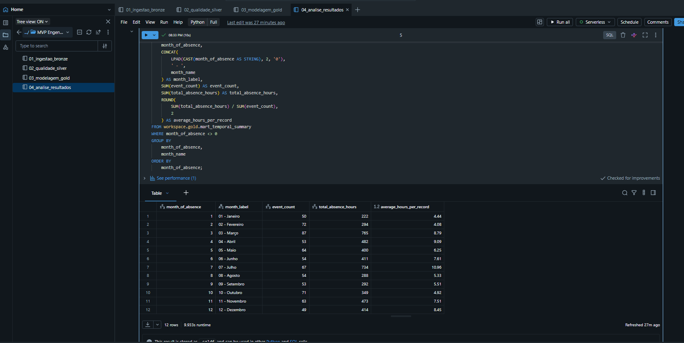

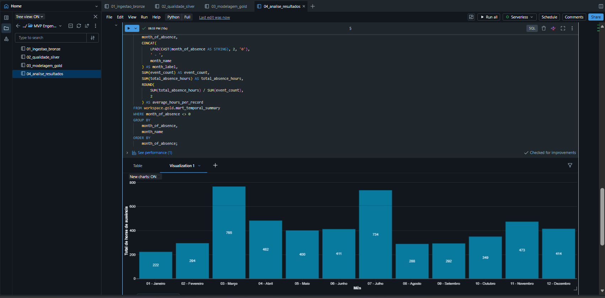

### 7.4 Como o absenteísmo varia entre as faixas etárias?

| Faixa etária | Registros | Horas | Média por registro |
|---|---:|---:|---:|
| Até 29 anos | 130 | 709 | 5,45 |
| 30 a 39 anos | 410 | 2.855 | 6,96 |
| 40 a 49 anos | 154 | 971 | 6,31 |
| 50 anos ou mais | 46 | 589 | 12,80 |

A faixa de **50 anos ou mais apresentou a maior média, com 12,80 horas por registro**. A menor média foi observada entre empregados com até 29 anos, com 5,45 horas. Já o grupo de 30 a 39 anos concentrou o maior total de horas, acompanhado da maior quantidade de registros.

As quatro faixas somam 740 registros e 5.124 horas. A diferença de tamanho entre os grupos e a possibilidade de várias ocorrências por empregado limitam comparações individuais. A idade usada na classificação vem do perfil mais frequente do empregado, sem acompanhamento histórico. Os resultados não demonstram que a idade cause as ausências.

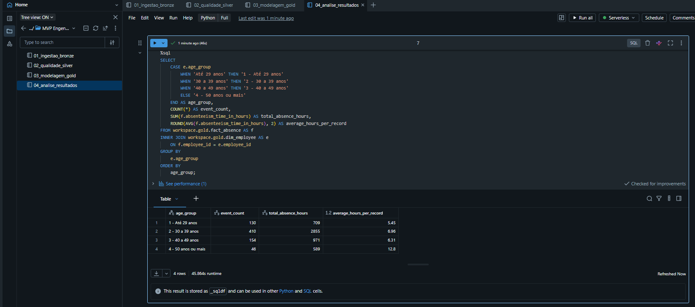

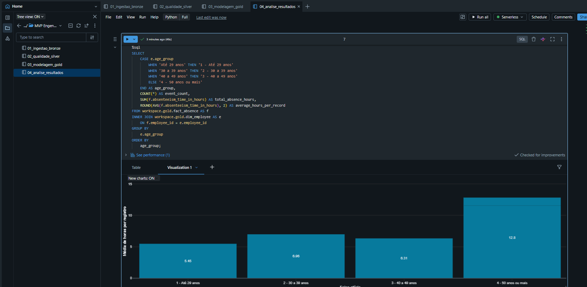

### 7.5 Como o absenteísmo varia conforme a distância entre residência e trabalho?

| Distância | Registros | Horas | Média por registro |
|---|---:|---:|---:|
| Até 10 km | 61 | 374 | 6,13 |
| 11 a 20 km | 168 | 1.686 | 10,04 |
| 21 a 30 km | 222 | 1.264 | 5,69 |
| Acima de 30 km | 289 | 1.800 | 6,23 |

A faixa de **11 a 20 km apresentou a maior média, com 10,04 horas por registro**. A menor média foi observada entre 21 e 30 km, com 5,69 horas. O grupo acima de 30 km concentrou o maior total de horas e a maior quantidade de registros, mas não a maior média.

As quatro faixas somam 740 registros e 5.124 horas. O padrão observado não mostra crescimento contínuo da média conforme aumenta a distância. A análise descreve associações na base e não controla outros fatores, como motivo da ausência, transporte utilizado ou condições de trabalho. Não é possível concluir que a distância cause o absenteísmo.

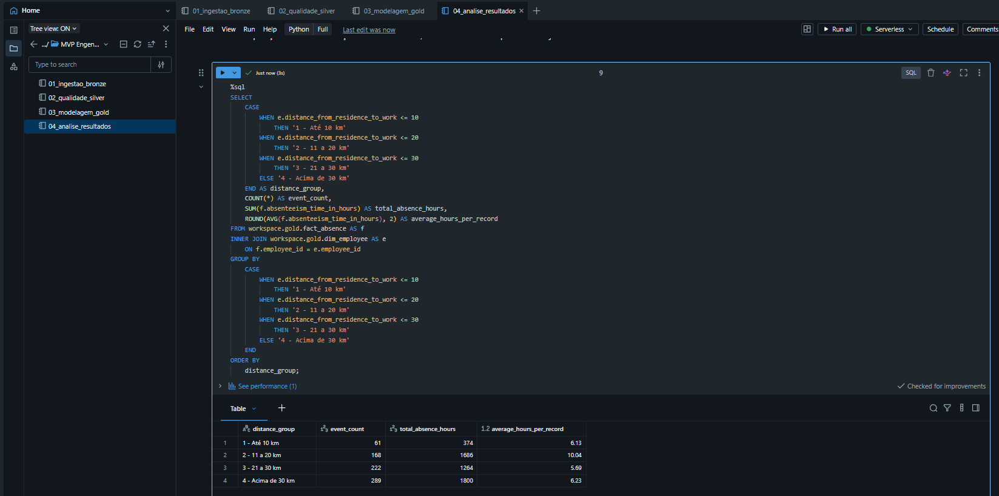

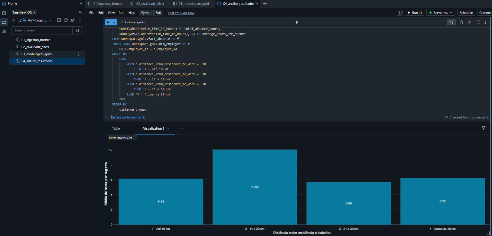

## 8. Conclusões Gerais

O texto a seguir reproduz as conclusões já registradas no notebook `04_analise_resultados`.

A base analisada contém 740 registros referentes a 36 empregados, totalizando 5.124 horas de ausência. A média foi de 6,92 horas por registro, enquanto a mediana foi de 3 horas. A diferença entre essas duas medidas indica que registros com durações mais elevadas influenciam a média geral.

Em relação aos motivos, as doenças osteomusculares e do tecido conjuntivo concentraram o maior total de horas de ausência, com 842 horas. Em seguida, aparecem as lesões, intoxicações e outras consequências de causas externas, com 729 horas, e as consultas médicas, com 424 horas. Esses resultados indicam maior concentração das horas de ausência nos dois primeiros grupos.

Na distribuição mensal, março apresentou o maior total de horas de ausência, com 765 horas, enquanto janeiro apresentou o menor, com 222 horas. Essa variação demonstra que as ausências não se distribuíram uniformemente ao longo dos meses analisados.

Na comparação por idade, os empregados com 50 anos ou mais apresentaram a maior média de horas de ausência por registro, com 12,8 horas. A menor média foi observada entre os empregados com até 29 anos, com 5,45 horas.

Na análise da distância entre residência e trabalho, a faixa de 11 a 20 km apresentou a maior média, com 10,04 horas por registro. A menor média foi encontrada na faixa de 21 a 30 km, com 5,69 horas.

Os resultados permitem identificar grupos, períodos e motivos que podem receber maior atenção em análises posteriores. Entretanto, todas as análises realizadas são descritivas. As diferenças encontradas não comprovam que o mês, a idade ou a distância sejam causas do absenteísmo.

Também é necessário considerar que as faixas etárias e de distância podem conter quantidades diferentes de registros. Além disso, a base representa uma única organização e um período específico, o que limita a generalização dos resultados para outras empresas ou populações.

Como aplicação prática, os dados podem apoiar o monitoramento agregado do absenteísmo, o planejamento de ações de saúde ocupacional e a investigação de períodos com maior concentração de horas de ausência. Os resultados não devem ser utilizados isoladamente para avaliar empregados ou tomar decisões individuais.

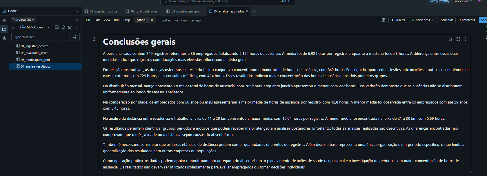

## 9. Autoavaliação

Considero que o objetivo principal do MVP foi atingido: organizei um pipeline na nuvem que parte de um arquivo de origem, registra as verificações de qualidade, persiste tabelas analíticas e permite responder às quatro perguntas de negócio. A preservação dos 740 registros entre as camadas e a conferência dos resultados ajudaram a acompanhar o efeito das transformações.

Entre os desafios do desenvolvimento, destaco compreender a diferença entre o schema inicialmente lido e o schema após a renomeação, converter os tipos sem alterar o significado dos campos, interpretar repetições sem uma chave única de ocorrência e definir uma dimensão de empregados que não multiplicasse os registros nas junções. A revisão também permitiu remover uma criação repetida de `dim_period` e conferir a correspondência entre consultas, tabelas, gráficos e textos.

O trabalho consolidou meu aprendizado sobre a separação entre ingestão, preparação e consumo analítico, o uso de PySpark e SQL e a importância de documentar os dados. Aprendi que uma decisão de qualidade precisa considerar o contexto: excluir automaticamente registros repetidos ou valores extremos poderia comprometer as respostas.

As quatro perguntas foram respondidas no nível descritivo proposto. Permanecem limitações: a base representa uma única organização, não tem data completa nem horas de trabalho previstas, contém várias observações por empregado e utiliza um perfil representativo sem histórico. Além disso, a acurácia dos fatos não foi auditada na organização de origem. O pipeline atual gera relatórios de qualidade, mas não implementa um bloqueio automático da carga diante de todos os problemas possíveis.

Como trabalhos futuros, proponho:

1. Automatizar a execução sequencial, com registro de falhas e alertas de qualidade.
2. Parametrizar catálogo, schemas e caminho do arquivo, reduzindo dependências de nomes fixos.
3. Adicionar verificações explícitas de unicidade das dimensões, integridade dos relacionamentos e reconciliação dos totais entre camadas, com critérios de interrupção da carga.
4. Definir desempate determinístico na seleção do perfil mais frequente e avaliar histórico de atributos quando houver datas confiáveis.
5. Utilizar uma fonte com identificador único de ocorrência, data completa, horas previstas e informações de exposição, permitindo cargas incrementais e indicadores normalizados.
6. Ampliar o acompanhamento por meio de um painel agregado e avaliar a sensibilidade dos resultados a diferentes critérios estatísticos, mantendo rastreabilidade das decisões.

## 10. Estrutura do Repositório

| Caminho | Conteúdo |
|---|---|
| [README.md](README.md) | Documento principal com contexto, catálogo, pipeline, qualidade, análises e evidências |
| [notebooks/01_ingestao_bronze.py](notebooks/01_ingestao_bronze.py) | Ingestão do CSV e persistência da Bronze |
| [notebooks/02_qualidade_silver.py](notebooks/02_qualidade_silver.py) | Padronização, qualidade e persistência da Silver |
| [notebooks/03_modelagem_gold.py](notebooks/03_modelagem_gold.py) | Modelagem dimensional, marts e documentação do catálogo |
| [notebooks/04_analise_resultados.py](notebooks/04_analise_resultados.py) | Consultas, interpretações e conclusões |
| [evidencias_mvp/](evidencias_mvp/) | 21 imagens incorporadas nas seções deste README |

Os nomes dos prints foram mantidos conforme a organização do projeto. As etapas 05 e 06 possuem partes `a` e `b`, por isso a numeração termina em 19, embora existam 21 arquivos. Os quatro notebooks foram exportados no formato de origem do Databricks, com extensão `.py`, incluindo células Python, SQL e Markdown.

## 11. Como Executar

### 11.1 Preparar o ambiente e o arquivo

1. Acesse um workspace do **Databricks Free Edition** com recursos de execução disponíveis e permissão para criar schemas, volumes e tabelas no catálogo `workspace`.
2. Baixe a base na [página da UCI](https://archive.ics.uci.edu/dataset/445/absenteeism+at+work), extraia o pacote e localize `Absenteeism_at_work.csv`. Preserve o nome, a ordem das 21 colunas e o separador `;`.
3. No **Workspace**, crie uma pasta para o projeto e utilize **Import** para importar os quatro arquivos `.py` da pasta `notebooks`. Eles devem ser reconhecidos como notebooks Databricks, com as células SQL e Markdown preservadas.
4. Antes da primeira execução completa, prepare os objetos abaixo em uma célula SQL. O comando `USE CATALOG` também deve ser executado no notebook 1, pois suas instruções iniciais de criação de schema não qualificam o catálogo.

```sql
USE CATALOG workspace;
CREATE SCHEMA IF NOT EXISTS workspace.bronze;
CREATE SCHEMA IF NOT EXISTS workspace.silver;
CREATE SCHEMA IF NOT EXISTS workspace.gold;
CREATE VOLUME IF NOT EXISTS workspace.bronze.raw_files;
```

5. Pelo **Catalog Explorer**, acesse o volume `workspace.bronze.raw_files` e envie o CSV. Confirme que ele está diretamente nesse volume, no caminho abaixo, sem uma pasta intermediária:

```text
/Volumes/workspace/bronze/raw_files/Absenteeism_at_work.csv
```

Os comandos de preparação já aparecem, em parte, no notebook 1. A preparação anterior ao primeiro **Run all** permite que o arquivo seja enviado antes da célula de leitura. Os nomes de catálogo e o caminho estão fixos nos scripts; outro ambiente exige adequação consistente dessas referências.

### 11.2 Executar os notebooks na ordem

Em cada notebook, selecione um recurso de execução compatível com PySpark e SQL, clique em **Run all** e aguarde a conclusão antes de iniciar o seguinte:

1. `01_ingestao_bronze`
2. `02_qualidade_silver`
3. `03_modelagem_gold`
4. `04_analise_resultados`

Os arquivos foram preparados para execução como notebooks no Databricks. As células SQL e Markdown são codificadas no formato de exportação da plataforma; executar o `.py` diretamente em um terminal Python não reproduz o fluxo completo.

### 11.3 Conferir os resultados

| Verificação | Resultado da execução documentada |
|---|---:|
| Bronze | 740 linhas e 23 colunas |
| Silver | 740 linhas e 23 colunas |
| `dim_employee` | 36 linhas |
| `dim_reason` | 29 linhas |
| `dim_period` | 82 linhas |
| `fact_absence` | 740 linhas |
| `mart_reason_summary` | 28 linhas |
| `mart_temporal_summary` | 19 linhas |
| Empregados distintos na fato | 36 |
| Total de horas | 5.124 |
| Média por registro | 6,92 horas |
| Mediana por registro | 3 horas |

A validação da Bronze está na leitura da tabela após a gravação, no notebook 1. A comparação Silver × fato e as contagens Gold estão no notebook 3. Os indicadores gerais estão na primeira consulta de resultados do notebook 4. Localize as células pelo conteúdo, pois sua numeração pode mudar após edições.

O retorno **No rows returned** após comandos de criação de tabela é esperado: esses comandos persistem objetos e não retornam uma tabela de consulta. Confirme os resultados nas células `SELECT` e verifique a ausência de falhas na execução.

### 11.4 Recriar as visualizações

Os arquivos de origem contêm o código e os textos, mas não incluem as saídas e as configurações de visualização criadas na interface. Os gráficos utilizados na entrega estão preservados nos prints incorporados neste README. Para recriá-los, execute as consultas do notebook 4 e adicione uma visualização de barras sobre cada resultado:

| Análise | Categoria | Medida | Ordenação |
|---|---|---|---|
| Motivos | `reason_description` | `total_absence_hours` | Horas em ordem decrescente |
| Meses | `month_label` | `total_absence_hours` | Mês em ordem crescente |
| Faixa etária | `age_group` | `average_hours_per_record` | Prefixo numérico da faixa |
| Distância | `distance_group` | `average_hours_per_record` | Prefixo numérico da faixa |

Cada consulta já retorna uma linha por categoria do gráfico; utilize a medida dessa linha, evitando uma contagem de linhas no lugar das horas.

Documentação de apoio: [importação e exportação de notebooks](https://docs.databricks.com/gcp/en/notebooks/notebook-export-import) e [arquivos em volumes do Unity Catalog](https://docs.databricks.com/aws/en/volumes/volume-files).

### 11.5 Consultar a entrega no GitHub

Mantenha `README.md`, `notebooks` e `evidencias_mvp` no mesmo nível da raiz do repositório. Os caminhos relativos das imagens dependem dessa organização. Na página principal do GitHub, verifique a renderização dos prints e o acesso aos quatro notebooks. O README é o documento agregador da entrega; não é necessário um PDF adicional.
